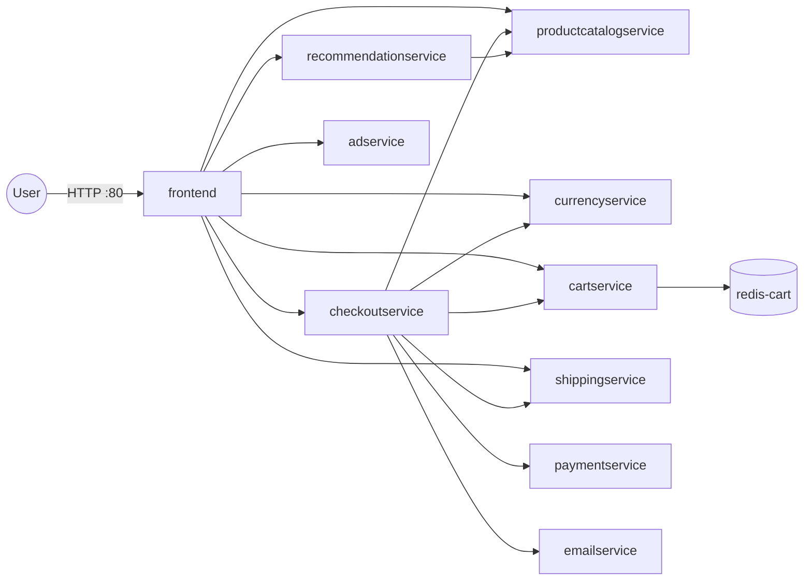

# Helm Charts for Microservices

Deploy Google's [Online Boutique](https://github.com/GoogleCloudPlatform/microservices-demo) (microservices-demo `v0.8.0`) to Kubernetes using **two reusable Helm charts** instead of one large plain-YAML manifest.

The eleven components of the shop (ten application services plus a Redis cache) are all rendered from just two charts:

| Chart | Used for |
|-------|----------|
| `charts/microservice` | Generic, reusable chart for every stateless application service |
| `charts/redis` | Redis instance used by the cart service |

Each service only needs a small values file in `values/` that describes its name, image, ports, replicas and environment variables. The whole stack can be installed with a shell script or declaratively with [Helmfile](https://github.com/helmfile/helmfile).

---

## Repository structure

```
.
├── charts/
│   ├── microservice/          # Shared chart for all application services
│   │   ├── Chart.yaml
│   │   ├── values.yaml        # Default values (placeholders)
│   │   └── templates/
│   │       ├── deployment.yaml
│   │       └── service.yaml
│   └── redis/                 # Chart for the Redis cart store
│       ├── Chart.yaml
│       ├── values.yaml
│       └── templates/
│           ├── deployment.yaml
│           └── service.yaml
├── values/                    # One values file per service
│   ├── ad-service-values.yaml
│   ├── cart-service-values.yaml
│   ├── checkout-service-values.yaml
│   ├── currency-service-values.yaml
│   ├── email-service-values.yaml
│   ├── frontend-values.yaml
│   ├── payment-service-values.yaml
│   ├── productcatalog-service-values.yaml
│   ├── recommendation-service-values.yaml
│   ├── redis-values.yaml
│   └── shipping-service-values.yaml
├── config.yaml                # Original plain Kubernetes manifests (reference only)
├── helmfile.yaml              # Declarative definition of all 11 releases
├── install.sh                 # Installs every release with `helm install`
└── uninstall.sh               # Removes every release with `helm uninstall`
```

`config.yaml` is the plain Kubernetes manifest the charts were derived from. It is not used by the scripts or the Helmfile, but it's useful for comparing the templated output with the original definitions.

---

## Architecture

All services talk to each other over gRPC through ClusterIP Services. Only the frontend is exposed outside the cluster, through a `LoadBalancer` Service on port 80.



### Services

| Release name | Kubernetes name | Image (`gcr.io/google-samples/microservices-demo/…`) | Container port | Service port | Service type | Replicas |
|---|---|---|---|---|---|---|
| `frontendservice` | `frontend` | `frontend:v0.8.0` | 8080 | 80 | LoadBalancer | 2 |
| `adservice` | `adservice` | `adservice:v0.8.0` | 9555 | 9555 | ClusterIP | 2 |
| `cartservice` | `cartservice` | `cartservice:v0.8.0` | 7070 | 7070 | ClusterIP | 2 |
| `checkoutservice` | `checkoutservice` | `checkoutservice:v0.8.0` | 5050 | 5050 | ClusterIP | 2 |
| `currencyservice` | `currencyservice` | `currencyservice:v0.8.0` | 7000 | 7000 | ClusterIP | 2 |
| `emailservice` | `emailservice` | `emailservice:v0.8.0` | 8080 | 5000 | ClusterIP | 2 |
| `paymentservice` | `paymentservice` | `paymentservice:v0.8.0` | 50051 | 50051 | ClusterIP | 2 |
| `productcatalogservice` | `productcatalogservice` | `productcatalogservice:v0.8.0` | 3550 | 3550 | ClusterIP | 2 |
| `recommendationservice` | `recommendationservice` | `recommendationservice:v0.8.0` | 8080 | 8080 | ClusterIP | 2 |
| `shippingservice` | `shippingservice` | `shippingservice:v0.8.0` | 50051 | 50051 | ClusterIP | 2 |
| `rediscart` | `redis-cart` | `redis:alpine` (Docker Hub) | 6379 | 6379 | ClusterIP | 1 (Helmfile) / 2 (`install.sh`) |

---

## Prerequisites

- A Kubernetes cluster (Minikube, kind, Docker Desktop, or a managed cluster such as GKE, EKS, AKS or Linode LKE)
- [`kubectl`](https://kubernetes.io/docs/tasks/tools/) configured to talk to that cluster
- [Helm 3](https://helm.sh/docs/intro/install/)
- [Helmfile](https://github.com/helmfile/helmfile) *(optional — only for the Helmfile workflow)*

Check that everything is connected:

```bash
kubectl cluster-info
helm version
```

---

## Getting started

Clone the repository:

```bash
git clone https://github.com/Nurmuhammedov12/helm-chart-microservices.git
cd helm-chart-microservices
```

### Option 1 — Helmfile (recommended)

Helmfile installs or upgrades all releases defined in `helmfile.yaml` in one step, and only changes what actually differs.

```bash
# Install or upgrade every release
helmfile sync

# Preview the changes before applying them (requires the helm-diff plugin)
helmfile diff

# Remove every release
helmfile destroy
```

### Option 2 — Shell scripts

```bash
# Install all charts
bash install.sh

# Uninstall all charts
bash uninstall.sh
```

`install.sh` runs a plain `helm install` per release, so running it twice fails with "cannot re-use a name that is still in use". Run `uninstall.sh` first, or use Helmfile for repeatable deployments.

### Option 3 — A single service with Helm

```bash
helm install -f values/cart-service-values.yaml cartservice charts/microservice
```

---

## Verifying the deployment

```bash
helm ls
kubectl get pods
kubectl get svc
```

Get the external address of the shop:

```bash
kubectl get svc frontend
```

Open the `EXTERNAL-IP` in your browser. On a local cluster without a load-balancer implementation, use one of these instead:

```bash
# Minikube
minikube service frontend

# Any cluster
kubectl port-forward svc/frontend 8080:80
# then open http://localhost:8080
```

---

## Chart reference

### `charts/microservice`

Renders one `Deployment` and one `Service` named after `appName`.

| Value | Description | Default |
|-------|-------------|---------|
| `appName` | Name of the Deployment, Service, container and `app` label | `servicename` |
| `appImage` | Container image repository | *(empty)* |
| `appVersion` | Image tag | `v0.0.0` |
| `appReplicas` | Number of pod replicas | `1` |
| `containerPort` | Port the container listens on (also the Service `targetPort`) | `8080` |
| `containerEnvVars` | List of `{name, value}` environment variables; values are quoted automatically | one placeholder entry |
| `servicePort` | Port exposed by the Service | `8080` |
| `serviceType` | Kubernetes Service type (`ClusterIP`, `NodePort`, `LoadBalancer`) | `ClusterIP` |

### `charts/redis`

Renders a Redis `Deployment` (with TCP liveness/readiness probes, resource requests/limits and an `emptyDir` volume) and a `ClusterIP` Service.

| Value | Description | Default |
|-------|-------------|---------|
| `appName` | Name of the Deployment, Service and `app` label | `redis` |
| `appReplicas` | Number of pod replicas | `1` |
| `appImage` | Redis image | `redis` |
| `appVersion` | Image tag | `alpine` |
| `volumeName` | Name of the data volume | `redis-data` |
| `containerMountPath` | Where the volume is mounted | `/data` |
| `containerPort` | Redis container port | `6379` |
| `servicePort` | Service port | `6379` |

Resource requests (`70m` CPU / `200Mi`) and limits (`125m` CPU / `300Mi`) are currently hard-coded in the template.

### Inspecting the rendered manifests

```bash
# Render one service locally without installing it
helm template -f values/frontend-values.yaml frontendservice charts/microservice

# Lint a chart with a given values file
helm lint charts/microservice -f values/checkout-service-values.yaml
```

---

## Adding a new service

1. Create `values/my-service-values.yaml`:

   ```yaml
   appName: myservice
   appImage: my-registry/myservice
   appVersion: v1.0.0
   appReplicas: 2
   containerPort: 8080
   containerEnvVars:
   - name: PORT
     value: "8080"

   servicePort: 8080
   ```

2. Add a release to `helmfile.yaml`:

   ```yaml
     - name: myservice
       chart: charts/microservice
       values:
         - values/my-service-values.yaml
   ```

3. Optionally add matching lines to `install.sh` and `uninstall.sh`.

4. Run `helmfile sync`.

---

## Known issues and possible improvements

- **Ad service address typo:** `values/frontend-values.yaml` sets `AD_SERVICE_ADDR` to `adservice:955`, but the ad service listens on `9555`. Ads won't load on the frontend until this is changed to `adservice:9555`.
- **Different Redis replica counts:** `install.sh` uses `appReplicas: 2` from `values/redis-values.yaml`, while `helmfile.yaml` overrides it to `1`. Because each Redis pod has its own `emptyDir` volume, two replicas means two independent caches and carts can appear to "disappear" between requests. One replica (the Helmfile setting) is the safer choice.
- **No probes or resource limits in the microservice chart:** the original `config.yaml` defines gRPC liveness/readiness probes (and an HTTP `/_healthz` probe for the frontend) plus resource requests/limits; the `microservice` chart doesn't template these yet.
- **Redis data is not persistent:** the Redis chart uses `emptyDir`, so cart data is lost when the pod restarts. A `PersistentVolumeClaim` would be needed for durable storage.
- **Default chart metadata:** both `Chart.yaml` files still have the scaffolded description ("A Helm chart for Kubernetes") and `appVersion: "1.16.0"`.

---

## Credits

The application code and container images come from Google Cloud Platform's [microservices-demo](https://github.com/GoogleCloudPlatform/microservices-demo) project. This repository contains only the Helm packaging around it.
